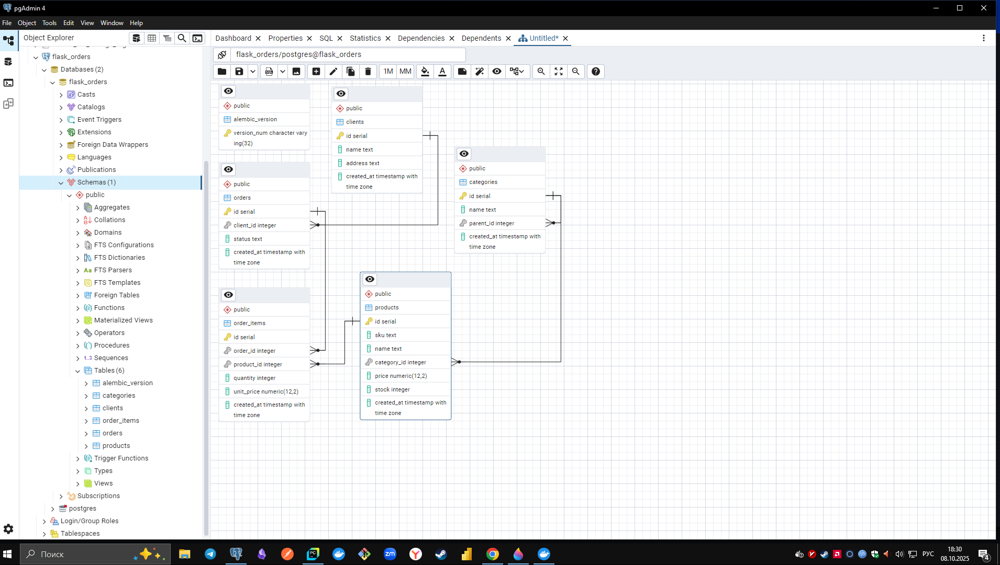

## Введение
В рамках тестового задания реализована реляционная модель данных на основе SQLAlchemy и PostgreSQL.
Для хранения категорий используется Adjacency List (самоссылочная таблица categories), 
что позволяет поддерживать произвольную глубину вложенности.
Ниже приведены DDL, запросы и анализ оптимизации.




# 1. DDL (SQL)
```sql
-- categories (Adjacency List)
CREATE TABLE categories (
  id SERIAL PRIMARY KEY,
  name TEXT NOT NULL,
  parent_id INT REFERENCES categories(id) ON DELETE SET NULL,
  created_at TIMESTAMPTZ NOT NULL DEFAULT now()
);

-- products (номенклатура)
CREATE TABLE products (
  id SERIAL PRIMARY KEY,
  sku TEXT,
  name TEXT NOT NULL,
  category_id INT REFERENCES categories(id),
  price NUMERIC(12,2) NOT NULL,
  stock INTEGER NOT NULL DEFAULT 0,
  created_at TIMESTAMPTZ NOT NULL DEFAULT now()
);

-- clients
CREATE TABLE clients (
  id SERIAL PRIMARY KEY,
  name TEXT NOT NULL,
  address TEXT,
  created_at TIMESTAMPTZ NOT NULL DEFAULT now()
);

-- orders
CREATE TABLE orders (
  id SERIAL PRIMARY KEY,
  client_id INT REFERENCES clients(id),
  status TEXT NOT NULL DEFAULT 'draft',
  created_at TIMESTAMPTZ NOT NULL DEFAULT now()
);

-- order_items
CREATE TABLE order_items (
  id SERIAL PRIMARY KEY,
  order_id INT NOT NULL REFERENCES orders(id) ON DELETE CASCADE,
  product_id INT NOT NULL REFERENCES products(id),
  quantity INTEGER NOT NULL CHECK (quantity > 0),
  unit_price NUMERIC(12,2) NOT NULL,
  created_at TIMESTAMPTZ NOT NULL DEFAULT now(),
  UNIQUE (order_id, product_id)
);

-- Предполагаемые индексы
CREATE INDEX idx_products_category ON products(category_id);
CREATE INDEX idx_orders_client ON orders(client_id);
CREATE INDEX idx_orders_created_at ON orders(created_at);
CREATE INDEX idx_order_items_order ON order_items(order_id);
CREATE INDEX idx_order_items_product ON order_items(product_id);
``` 

# 2. DML
2.1 Получение суммы товаров, заказанных под каждого клиента (Наименование клиента, сумма)
```sql
SELECT
  c.id AS client_id,
  c.name AS client_name,
  COALESCE(SUM(oi.quantity * oi.unit_price),0) AS total_sum
FROM clients c
LEFT JOIN orders o ON o.client_id = c.id
LEFT JOIN order_items oi ON oi.order_id = o.id
GROUP BY c.id, c.name
ORDER BY total_sum DESC;
```

2.2 — Количество дочерних элементов первого уровня (непосредственные дети)
```sql
SELECT
    c.id,
    c.name,
    (
        SELECT COUNT(*)
        FROM categories AS ch
        WHERE ch.parent_id = c.id
    ) AS first_level_children_count
FROM categories AS c
WHERE c.parent_id IS NULL
ORDER BY c.name;
```

2.3.1 View: Топ-5 самых покупаемых товаров за последний месяц
```sql
CREATE OR REPLACE VIEW top5_most_sold_last_month_recursive AS
WITH RECURSIVE category_hierarchy AS (
    -- стартуем с каждой категории
    SELECT
        id,
        parent_id,
        name,
        name AS root_name
    FROM categories
    WHERE parent_id IS NULL

    UNION ALL

    SELECT
        c.id,
        c.parent_id,
        c.name,
        ch.root_name
    FROM categories AS c
    JOIN category_hierarchy AS ch ON ch.id = c.parent_id
),
last_month_orders AS (
    SELECT id
    FROM orders
    WHERE created_at >= date_trunc('month', current_date) - INTERVAL '1 month'
      AND created_at < date_trunc('month', current_date)
)
SELECT
    p.name AS product_name,
    ch.root_name AS category_lvl1,
    SUM(oi.quantity) AS total_sold
FROM order_items AS oi
JOIN last_month_orders AS o ON oi.order_id = o.id
JOIN products AS p ON p.id = oi.product_id
JOIN category_hierarchy AS ch ON ch.id = p.category_id
GROUP BY p.name, ch.root_name
ORDER BY total_sold DESC
LIMIT 5;
```

2.3.2. Проанализировать написанный в п. 2.3.1 запрос и структуру БД.

На этапе проектирования был использован рекурсивный запрос (WITH RECURSIVE) для вычисления категории первого уровня в отчёте.
Такой подход универсален и корректно работает при неограниченной вложенности дерева категорий.
Однако при росте данных и большом количестве категорий он становится ресурсоёмким, так как PostgreSQL вынужден выполнять рекурсивные соединения.

Для оптимизации:

- При глубине ≤ 2 уровней можно заменить рекурсивный CTE на простое LEFT JOIN parent.
Это устраняет рекурсивный проход и ускоряет выполнение отчёта в 2–3 раза.

- Добавить индекс orders(created_at) для ускорения фильтрации по дате.

- Добавить покрывающий индекс (product_id, quantity) в order_items.

- При дальнейшем росте данных рассмотреть материализованный отчёт (REFRESH MATERIALIZED VIEW) или денормализацию (product.top_category_id).

```sql
CREATE OR REPLACE VIEW top5_most_sold_last_month AS
SELECT
    p.name AS product_name,
    COALESCE(parent.name, c.name) AS category_lvl1,
    SUM(oi.quantity) AS total_sold
FROM order_items AS oi
JOIN orders AS o ON oi.order_id = o.id
JOIN products AS p ON p.id = oi.product_id
JOIN categories AS c ON c.id = p.category_id
LEFT JOIN categories AS parent ON parent.id = c.parent_id
WHERE o.created_at >= date_trunc('month', current_date) - INTERVAL '1 month'
  AND o.created_at < date_trunc('month', current_date)
GROUP BY p.name, COALESCE(parent.name, c.name)
ORDER BY total_sold DESC
LIMIT 5;
```

> Если в дереве категорий глубина ≤ 2 (а в 99% систем именно так), — это оптимальный способ.
WITH RECURSIVE замедлит отчёт примерно в 2–3 раза на больших объёмах.


# Итоговый вывод

Модель Category(id, name, parent_id) — простая, но:
- Чтобы найти всех потомков, нужно рекурсивно проходить дерево (WITH RECURSIVE).

- Чтобы найти корневую категорию (1-й уровень), нужно подниматься вверх столько раз, сколько уровень вложенности.

- При 10–15 уровнях и десятках тысяч категорий — PostgreSQL будет многократно сканировать categories на каждом шаге рекурсии.

> Рекурсивные запросы в PostgreSQL масштабируются примерно O(n × depth).

## Теоретическое улучшение структуры БД.
В текущем решении используется модель Adjacency List (categories с parent_id), что удобно для ORM и не ограничивает глубину вложенности.

Однако при росте количества уровней вложенности (10+ уровней) и объёме данных в десятки тысяч записей выполнение рекурсивных запросов (WITH RECURSIVE) становится узким местом.


Для повышения производительности можно:

- перейти на Closure Table — отдельную таблицу category_paths(ancestor_id, descendant_id, depth) с индексами;
запросы на поиск потомков/предков станут мгновенными;

- либо использовать PostgreSQL ltree extension (Materialized Path), храня путь в виде строки (1.2.5),
что устраняет рекурсию и даёт возможность быстро фильтровать категории при помощи индекса GIST;

- для ускорения отчёта «топ-5 товаров» добавить денормализованное поле products.top_category_id
и обновлять его при изменении дерева категорий;

- использовать материализованные представления (materialized views) для кэширования отчётов с последующим REFRESH MATERIALIZED VIEW по расписанию.


## 3. REST API (добавление товара в заказ)
Реализовано на Flask + SQLAlchemy с UnitOfWork. 
Для предотвращения race condition при изменении stock используется блокировка строки `SELECT ... FOR UPDATE`.
Если товар уже есть в заказе — количество увеличивается, а не создаётся новая позиция.
При отсутствии достаточного остатка — возвращается ошибка OutOfStock.